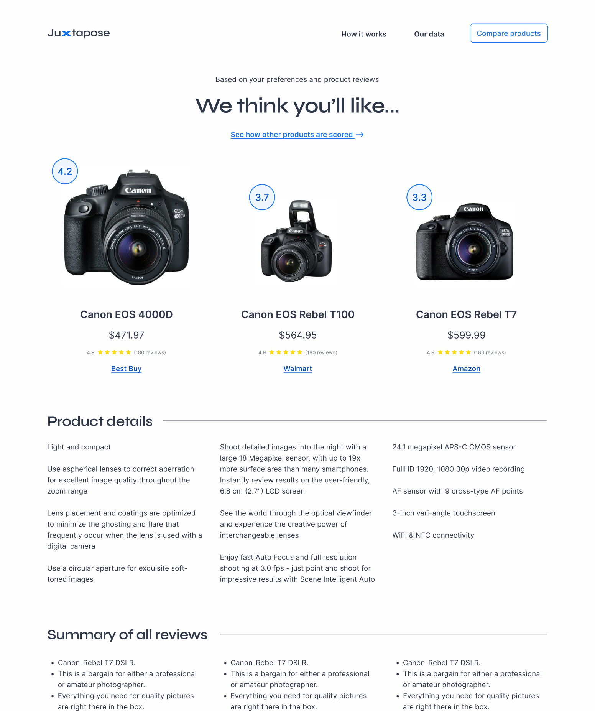

<a id="readme-top"></a>

<!-- PROJECT LOGO -->
<br />
<div align="center">
    <a href="https://github.com/tzada8/capstone">
        
    </a>
    <h3 align="center">Juxtapose: Recommendation & Comparison Application for Improving Purchasing Decisions</h3>
    <p align="center">
        Juxtapose is a web application designed to help online shoppers tackle the difficulty of making well-informed and confident purchasing decisions by alleviating decision paralysis and information overload.
        <br />
        <br />
        <a href="https://capstone-backend-zup0.onrender.com">Backend Production</a>
        ·
        <a href="https://juxtapose-4a7f46fad866.herokuapp.com/">Frontend Production</a>
        </p>
</div>

<!-- TABLE OF CONTENTS -->
<details>
    <summary>Table of Contents</summary>
    <ol>
        <li>
            <a href="#about-the-project">About The Project</a>
        </li>
        <li>
            <a href="#getting-started">Getting Started</a>
            <ul>
                <li><a href="#installations">Installations</a></li>
                <li><a href="#backend-setup">Backend Setup</a></li>
                <li><a href="#frontend-setup">Frontend Setup</a></li>
            </ul>
        </li>
        <li>
            <a href="#adding-additional-packages">Adding Additional Packages</a>
            <ul>
                <li><a href="#backend-packages">Backend Packages</a></li>
                <li><a href="#frontend-packages">Frontend Packages</a></li>
            </ul>
        </li>
        <li>
            <a href="#starting-the-app">Starting the App</a>
            <ul>
                <li><a href="#backend-startup">Backend Startup</a></li>
                <li><a href="#frontend-startup">Frontend Startup</a></li>
            </ul>
        </li>
        <li>
            <a href="#testing">Testing</a>
            <ul>
                <li><a href="#backend-tests">Backend Tests</a></li>
                <li><a href="#frontend-tests">Frontend Tests</a></li>
            </ul>
        </li>
        <li><a href="#acknowledgments">Acknowledgments</a></li>
    </ol>
</details>


<!-- ABOUT THE PROJECT -->
## About The Project

<div align="center">
    
</div>
<br/>

Juxtapose helps shoppers make improved purchasing decisions by ensuring they feel less overwhelmed by the number of product options and volume of information available. By aggregating specifications, peer reviews, expert reviews, and related videos, and providing tailored recommendations, shoppers can reach purchasing decisions with ease!

To use Juxtapose, you can:

1. <b>Search</b>: Search for product category (ex. DSLR cameras)
2. <b>Set filters & preferences</b>: Set filters and rank your feature preferences
3. <b>View recommendations</b>: See the products we think you’ll like
4. <b>Compare</b>: Compare products and pick your favourite one

<p align="right">(<a href="#readme-top">back to top</a>)</p>


<!-- GETTING STARTED -->
## Getting Started

To get a local copy up and running, follow these simple steps. You must always have 2 terminals open, where one terminal points to the `backend` folder and the other points to the `frontend` folder.

### Installations

Ensure the following applications are locally installed:

- [Node](https://nodejs.org/en/download)
- [Python](https://www.python.org/downloads/)

### Backend Setup

Follow the steps listed below to setup your backend environment.

1. Open a new terminal
2. Change directory to the `backend` folder
    ```
    cd backend
    ```
3. Create a local virtual environment
    ```
    python3 -m venv .venv
    ```
4. Activate the virtual environment
    ```
    source .venv/bin/activate
    ```
5. Install `requirements` dependencies
    ```
    pip install -r requirements.txt
    ```
6. Install `NLTK` dependencies
    ```
    python3 -m nltk.downloader vader_lexicon
    ```
    Ensure your `{PYTHON_VERSION}` is identical to what's listed in your File Explorer. If you run into an error, try running
    ```
    pip install certifi /Applications/Python\ {PYTHON_VERSION}/Install\ Certificates.command
    ```
7. Create a `.env` file
    ```
    touch .env
    ```
8. Reach out to the team for the environment variables, adding them to the `.env` file
9. When needed, deactivate the local virtual environment
    ```
    deactivate
    ```

### Frontend Setup

Follow the steps listed below to setup your frontend environment.

1. Open a new terminal
2. Change directory to the `frontend` folder
    ```
    cd frontend
    ```
3. Install node dependencies
    ```
    npm install
    ```
4. Create a `.env` file
    ```
    touch .env
    ```
5. Reach out to the team for the environment variables, adding them to the `.env` file

<p align="right">(<a href="#readme-top">back to top</a>)</p>


<!-- ADDING ADDITIONAL PACKAGES -->
## Adding Additional Packages

To add additional packages when developing, follow these steps.

### Backend Packages

1. Change directory to the `backend` folder
    ```
    cd backend
    ```
2. Activate your virtual environment
    ```
    source .venv/bin/activate
    ```
3. Install the additional packages. As as example:
    ```
    pip install pandas
    ```
4. Update the `requirements` dependencies
    ```
    pip freeze > requirements.txt
    ```
5. Commit the `requirements.txt` file

### Frontend Packages

1. Change directory to the `frontend` folder
    ```
    cd frontend
    ```
2. Install the additional packages. As as example:
    ```
    npm install antd
    ```
3. Commit the `package.json` and `package-lock.json` files

<p align="right">(<a href="#readme-top">back to top</a>)</p>


<!-- STARTING THE APP -->
## Starting the App

To locally run the application, the following steps can be run. The `backend` can be run independently, but to run the `frontend`, the `backend` needs to also be run.

### Backend Startup

1. Change directory to the `backend` folder
    ```
    cd backend
    ```
2. Activate your virtual environment
    ```
    source .venv/bin/activate
    ```
3. Start the `backend` service
    ```
    flask --debug run --no-debugger
    ```

### Frontend Startup

1. Change directory to the `frontend` folder
    ```
    cd frontend
    ```
2. Start the `frontend` service
    ```
    npm start
    ```

<p align="right">(<a href="#readme-top">back to top</a>)</p>


<!-- TESTING -->
## Testing

To locally run the `backend` and `frontend` automated tests, run the following steps.

### Backend Tests

1. Change directory to the `backend` folder
    ```
    cd backend
    ```
2. Activate your virtual environment
    ```
    source .venv/bin/activate
    ```
3. Run the `backend` tests
    ```
    python3 -m unittest discover
    ```

### Frontend Tests

1. Change directory to the `frontend` folder
    ```
    cd frontend
    ```
2. Run the `frontend` tests
    ```
    npm test
    ```

<p align="right">(<a href="#readme-top">back to top</a>)</p>


<!-- ACKNOWLEDGMENTS -->
## Acknowledgments

Several acknowledgements to be made includes Prof. Kejia Zhu along with the following technologies

Backend APIs

- [Best Buy API](https://developer.bestbuy.com)
- [OpenAI](https://platform.openai.com)
- [RapidAPI](https://rapidapi.com/hub)
- [SerpAPI](https://serpapi.com)

Frontend Libraries
- [Ant Design Icons](https://ant.design/components/icon)
- [Google Fonts](https://fonts.google.com/)
- [React Icons](https://react-icons.github.io/react-icons/search)

<p align="right">(<a href="#readme-top">back to top</a>)</p>
